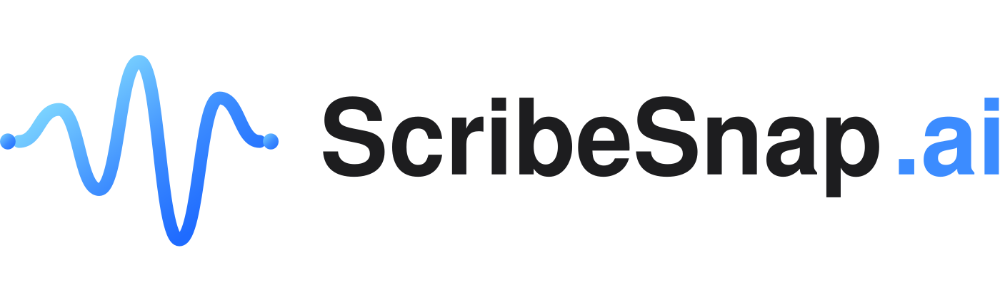

<div align="center">
  
  <br /><br />
  <p>
    
    
    
    
    
  </p>
  <p><strong>Extract transcripts from YouTube, Vimeo, TikTok, and more — then unlock AI-powered study tools in one click.</strong></p>
  <p><a href="https://scribesnap.ai">🌐 scribesnap.ai</a></p>
</div>

---

## About

**ScribeSnap** is a full-stack web application that pulls transcripts from videos across multiple platforms and enriches them with AI features: summaries, key insights, auto-generated flashcards, study guides, and interactive Q&A chat.

Whether you're a student reviewing a lecture, a researcher skimming a conference talk, or a professional turning webinars into notes, ScribeSnap converts any video into structured, searchable knowledge — instantly.

---

## Features

### Transcript Extraction
- **Multi-platform support** — YouTube, Vimeo, TikTok, Twitter/X, Instagram, Facebook, Loom, Wistia, Dailymotion
- **Auto-subtitle fallback** — tries native captions first, then falls back to Supadata for videos without them
- **Streaming delivery** — transcripts stream to the UI via Server-Sent Events (SSE) so you see content as it arrives
- **Timestamp preservation** — retains original timecodes for navigation

### AI Tools (powered by Groq + OpenRouter fallback)
- **Summary** — concise TL;DR of any video
- **Key Insights** — bullet-point takeaways extracted from the transcript
- **Flashcards** — auto-generated Q&A cards with topic tags; full-screen flip UI with known/unknown tracking
- **Study Guide** — structured document with overview, learning objectives, key concepts, sections, and review questions
- **Chapter Detection** — splits long videos into labeled chapters automatically
- **AI Chat** — ask follow-up questions about the transcript in a conversational interface

### Account & Credits
- **Supabase Auth** — email/password sign-up and login
- **Credit system** — authenticated users get a credit allowance; anonymous users get a limited free tier (configurable)
- **Per-user rate limiting** — separate RPM caps for authenticated vs. anonymous users
- **Token validation caching** — 60-second TTL cache on Supabase JWT checks to reduce auth latency

### Export
- Copy transcript to clipboard (plain text or formatted)
- Download as `.txt` file
- SRT subtitle format export

---

## Tech Stack

| Layer | Technology |
|-------|-----------|
| **Frontend** | React 18 (CRA), inline styles design system, framer-motion |
| **Backend** | Node.js 20+, Express 4 |
| **AI — Primary** | [Groq](https://groq.com/) (`llama-3.3-70b-versatile`) |
| **AI — Fallback** | [OpenRouter](https://openrouter.ai/) |
| **Transcript API** | `youtube-transcript` npm package + [Supadata](https://supadata.ai/) fallback |
| **Auth & Database** | [Supabase](https://supabase.com/) (Postgres + Auth) |
| **Deployment** | [Railway](https://railway.app/) (backend), Vercel-compatible (frontend) |
| **Containerization** | Docker (optional) |

### Architecture Overview

```
Browser (React SPA)
  │
  │  REST + SSE
  ▼
Express Server (server.js)
  ├── /api/transcript          ← SSE stream, credit gate
  ├── /api/summary             ← AI endpoint (auth-gated)
  ├── /api/insights            ← AI endpoint
  ├── /api/flashcards          ← AI endpoint → [{question, answer, topic}]
  ├── /api/study-guide         ← AI endpoint → structured JSON
  ├── /api/chapters            ← AI endpoint
  ├── /api/ask                 ← AI chat endpoint
  └── /api/video-meta          ← proxied metadata fetch
        │
        ├── Groq SDK  ──────── primary LLM
        ├── OpenRouter ──────── fallback LLM
        ├── youtube-transcript ─ native captions
        ├── Supadata ────────── caption fallback
        └── Supabase ────────── user auth + credits
```

---

## Getting Started

### Prerequisites
- Node.js ≥ 20
- npm ≥ 9
- A [Supabase](https://supabase.com/) project (free tier works)
- A [Groq](https://console.groq.com/) API key (free tier available)

### 1. Clone & install

```bash
git clone https://github.com/JoelMoyal/YouTube-Transcript-Extractor.git
cd YouTube-Transcript-Extractor

# Install server dependencies
npm install

# Install client dependencies
cd client && npm install && cd ..
```

### 2. Configure environment

Copy the example env file and fill in your keys:

```bash
cp .env.example .env   # or create .env manually
```

See the [Environment Variables](#environment-variables) section below for the full list.

### 3. Run in development

```bash
npm run dev
# Starts the Express server on :4999 and the React dev server on :3000
```

Open [http://localhost:3000](http://localhost:3000) in your browser.

### 4. Build for production

```bash
npm run build          # builds React into client/build/
npm start              # serves everything from Express on PORT (default 4999)
```

### Docker

```bash
docker build -t scribesnap .
docker run -p 4999:4999 --env-file .env scribesnap
```

---

## Environment Variables

Create a `.env` file in the project root:

```env
# ── AI ────────────────────────────────────────────────────────────────────────
GROQ_API_KEY=          # Groq API key (primary LLM)
OPENROUTER_API_KEY=    # OpenRouter API key (fallback LLM)

# ── Supabase ──────────────────────────────────────────────────────────────────
SUPABASE_URL=          # Your Supabase project URL
SUPABASE_SERVICE_KEY=  # Supabase service role key (server-side only)

# ── Transcript APIs ───────────────────────────────────────────────────────────
SUPADATA_API_KEY=      # Supadata API key (caption fallback)

# ── Rate Limits & Credits ─────────────────────────────────────────────────────
ANON_CREDITS_MAX=2            # Free transcript credits for anonymous users (per 7 days)
ANON_AI_MAX_PER_DAY=24        # Max AI calls/day for anonymous users
AI_ANON_RPM=6                 # AI requests-per-minute for anonymous users
AI_AUTH_RPM=20                # AI requests-per-minute for authenticated users
AI_REQUIRE_AUTH=0             # Set to 1 to require login for all AI features

# ── Server ────────────────────────────────────────────────────────────────────
PORT=4999
NODE_ENV=development
```

---

## Deployment

### Railway (recommended)
1. Connect your GitHub repo to [Railway](https://railway.app/)
2. Set all environment variables in the Railway dashboard
3. Railway auto-detects `package.json` and runs `npm start`

The included `railway.json` is pre-configured.

### Vercel (frontend only)
Deploy `client/` as a standalone Vite/CRA app and point `REACT_APP_API_URL` to your Railway backend URL.

---

## Project Structure

```
├── server.js              # Express backend — all API routes
├── client/
│   ├── src/
│   │   ├── App.js         # Entire React SPA (~9,800 lines)
│   │   ├── supabase.js    # Supabase client init
│   │   └── components/    # Magic UI components (BorderBeam, ShimmerButton…)
│   └── public/            # Static assets, SEO landing pages
├── supabase/              # DB migrations & edge functions
├── scripts/               # Utility scripts (secrets scan, etc.)
├── Dockerfile
└── railway.json
```

---

## License

This project is licensed under the **MIT License** — see the [LICENSE](LICENSE.md) file for details.

---

<div align="center">
  Made with ♥ by <a href="https://github.com/JoelMoyal">Joel Moyal</a>
  <br /><br />
  <a href="#top">↑ Back to top</a>
</div>
